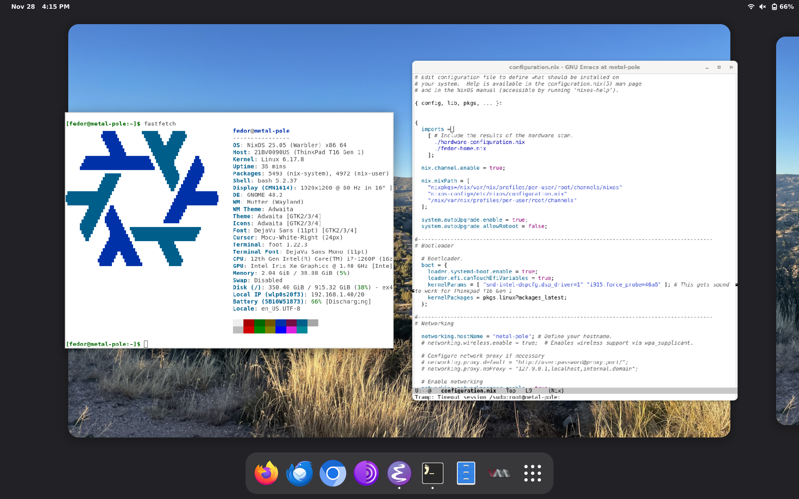

# Introduction
This is my NixOS configuration that I'm using on my laptop.

I am using home-manager to declaratively configure gnome.

This setup does not use flakes to keep it simple.

# The Setup
- Version: NixOS 25.11
- Host: Lenovo ThinkPad T16 Gen 1
- Destop Environment: gnome, hyprland
- Browser: firefox
- Terminal: foot
- Editor: emacs-pgtk
- Email: thunderbird

# Non-Declarative Setup Instructions
- Steam needs to be logged into to update and install games.
- Thunderbird email accounts need to be manually added
- Emacs needs to be configured by copying .emacs into ~/ .
- The GDM profile picture must be set.
- Firefox extentions need to be installed
- Firefox settings need to be set
- Application icons need to be organized in GNOME

# Images

The provided images are licensed under the WTFPL license.

**NOTE:** I use a few images that are copyright by others, so I can't store them in this repository. 
